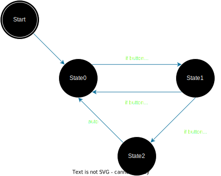
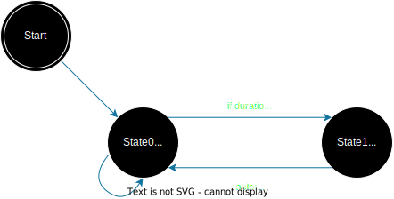

# State Transition Diagrams aka State Machines

- [A Very Informative Video](https://www.youtube.com/watch?v=v8KXa5uRavg) 
- A state transition diagram is a way to represent the flow of a logical system. Typically it is a very useful diagram to help decide algorithmic flow, and to also easily replicate the algorithm into usable code for a microcontroller or regular script. There are a few important rules to follow though while creating these logical systems. The most important is that any operation that happens does not “hang” the processor! This is extrememly important because we want the logical system to check it’s conditions as fast as possible and as many times per second as possible.  
- Let’s build the State Transisition Diagram for a State Machine that is trying to detect a long button press. First let’s layout what we think the system will do as a numbered list, then look at its diagram. 

  1. Detect button press 
  2. Continue checking if button is pressed 
  3. If button is pressed for >1 second print “long button press detected” 
  4. If button is released before 1 second print “long press NOT detected” 
  5. Reset related variables and go back to 1. 

In a State transition diagram there are 3 important shapes. The first is the start/end termination node. This node represents either the start or the termination of the state machine. We can think of the start node as plugging the power into the pico_w. Next we have the state node which is just a circle with the state’s name/number in it. This node tells us which state we are currently in and has arrows connected to it that let us know which states lead to this state, and which state this state can lead to! Lastly, we have the arrows that represent the transition between states. Typically an arrow or state transition condition will have an “if” statement tied to it that will check that a transition condition is met before jumping into the new state. (NOTE: I do somewhat break the "no hanging" rule by placing a call to either printf() or cout inside a state. This is done for simplicity! I highly recommend NOT putting print statements inside states when time critical processes are running from these state machines, but for these teaching purposes I let it slide, and for debugging it may be helpful as well) 

Here is an example diagram of the “long button press detect” state machine: 


A couple of important notes: If the arrow going between states (or from a state to itself) has no condition, that means immediately after we are in that state, we go to the state the no condition arrow points to. Of course we make sure any variable updates happen that are necessary before we switch states, but that is all that happens. In this case we are just detecting a button press by reading the voltage on a digital pin. Okay, so let’s turn this diagram into some usable code. First we’ll need some variables to allow the system to function: 


  1. A “state” variable, we will use an integer to represent the states 
  
  2. A “duration” variable that we will use to reference if the button has been pressed   long enough. 
  
  3. A “start_time” variable that will hold the time the beginning of the button press   has been detected. 
  
  4. A “current_time” variable that will hold the current time so we can compare the difference between state_time and current_time to the duration variable 

Hopefully you watched the state transition diagram video linked above. In that video a switch:case structure is used to define the state machine. Since you’ve seen that, we will instead create this with some nested ‘if’ statements just to see another way to build the same type of system in code!  

```
CODE HERE
```
There is one main issue with this state machine! If you continue holding the button after the first long button press detected, it will detect another button press!, even though we never re-pressed the button! This is because we aren’t looking for a release of the button before we reset the system! Think of a way you can solve this issue by either adding a state, or changing the transition condition for one of the states. This will be part of your state machine assignment. 

## Single Timing System


## Async Multiple Timing Systems
Similar to the Single Timing System, a multiple timing system is essentially just multiple Single Timing System state machines that run by themselves. If we’re clever and we prevent any processor hanging inside any states, we can create a pseudo “parallel processing” inside the pico_w even if we're only using 1 core of the processor to do all the work! Take a look at [multiple-timing-system.cpp](./multiple-timing-system.cpp)


Copyright (C) 2023 Michael Giglia  [`<michael.a.giglia@gmail.com>`]  

[`<michael.a.giglia@gmail.com>`]: mailto:michael.a.giglia@gmail.com